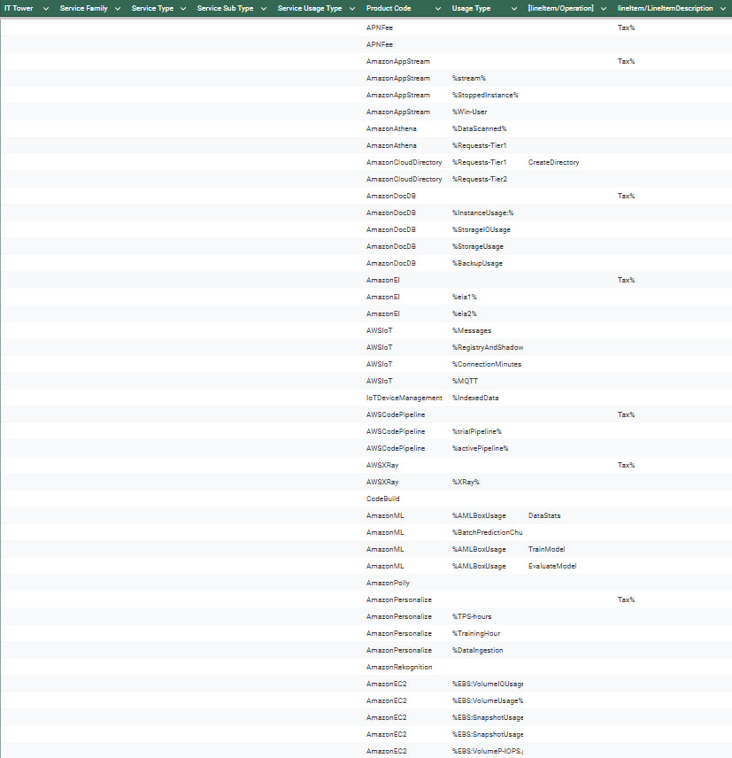

# Лабораторная работа 1.
# Знакомство с IaaS, PaaS, SaaS сервисами в облаке на примере Amazon Web Services (AWS). Создание сервисной модели.

## Вариант 5.
### Выполнили:

Гайдук Алина, Соболев Артём. Команда: Любим котов

Фоточка перед началом :3

### Цель работы:

Знакомство с облачными сервисами. Понимание уровней абстракции над инфраструктурой в облаке. Формирование понимания типов потребления сервисов в сервисной-модели. 

### Дано:

1. Слепок данных биллинга от провайдера после небольшой обработки в виде SQL-параметров. Символ % в начале/конце означает, что перед/после него может стоять любой набор символов.
2. Образец итогового соответствия, что желательно получить в конце. В этом же документе  

### Необходимо:

1. Импортировать файл .csv в Excel или любую другую программу работы с таблицами. Для Excel делается на вкладке Данные – Из текстового / csv файла – выбрать файл, разделитель – точка с запятой.
2. Распределить потребление сервисов по иерархии, чтобы можно было провести анализ от большего к меньшему (напр. От всех вычислительных ресурсов Compute дойти до конкретного типа использования - Выделенной стойка в датацентре Dedicated host usage).
3. Сохранить файл и залить в соответствующую папку на Google Drive.

### Алгоритм работы:

Сопоставить входящие данные от провайдера с его же документацией. Написать в соответствие колонкам справа значения 5 колонок слева, которые бы однозначно классифицировали тип сервиса. Для столбцов IT Tower и Service Family значения можно выбрать из образца.

## Ход работы:

1. Чтобы выполнить данную работу, нам понадобилось изучить структуру таблицы, по которой мы затем уже классифицировали потребление сервисов.
Ниже представлена таблица, описывающая иерархию классификации облачных сервисов в данной модели:

| **Название столбца**             | **Описание**                                                                                                                              | **Примеры**                                                    |
|----------------------------------|-------------------------------------------------------------------------------------------------------------------------------------------|----------------------------------------------------------------|
| **IT Tower**                     | Основная категория услуг, описывающая крупные области облачных технологий и их функционал.                                                | Compute, Storage, Database.                                    |
| **Service Family**               | Группа услуг, выполняющая определённые функции и относящаяся к конкретной задаче по инфраструктуре.                                       | Management & Governance, Application Integration, Analytics.   |
| **Service Type**                 | Конкретный тип сервиса внутри группы сервисов. Отражает его основное предназначение.                                                      | Amazon Partner Network, Amazon Athena, Amazon Cloud Directory. |
| **Service Sub Type**             | Уточнение функционала конкретного типа сервисов. Показывает, какие специфические возможности или аспекты сервиса используются.            | Additional Costs, Streaming Service, Windows Client.           |
| **Service Usage Type**           | Тип использования услуги, который указывает, каким образом и для каких целей потребляется ресурс. Учитывает подтипы и назначение сервиса. | Tax, Cloud Deployment, Windows Cooperation.                    |
| **Product Code**                 | Уникальный идентификатор услуги, используемый для учета в биллинге и идентификации.                                                       | APNFee, AmazonAppStream, AWSIoT.                               |
| **Usage Type**                   | Специфика использования, которая включает детали тарификации или другие характеристики, определяющие, как потребляется услуга.            | %stream%, %StoppedInstance%, %Win-User.                        |
| **lineItem/Operation**           | Показывает конкретное действие, которое совершалось с ресурсом.                                                                           | CreateDirectory, DataStats, TrainModel.                        |
| **lineItem/LineItemDescription** | Описание действия, совершаемого с ресурсом.                                                                                               | Tax%                                                           |

2. Мы сопоставили исходные данные с документацией AWS и выделили подходящие сервисы:

| **Название сервиса**                  | **Описание**                                                                                                                                                                                                                                                                                                                                                                                                                                            | **Примеры использования**                                                    |
|---------------------------------------|---------------------------------------------------------------------------------------------------------------------------------------------------------------------------------------------------------------------------------------------------------------------------------------------------------------------------------------------------------------------------------------------------------------------------------------------------------|------------------------------------------------------------------------------|
| **Amazon Patner Network**             | Партнерская программа, которая предоставляет доступ к ресурсам для создания, маркетинга и продажи решений на базе AWS.                                                                                                                                                                                                                                                                                                                                  | Повышение видимости на сайте AWS.                                            |
| **Amazon Application Stream**         | Сервис, который позволяет централизованно управлять приложениями для рабочего стола и безопасно передавать их на удаленные устройства без необходимости их локальнйо установки.                                                                                                                                                                                                                                                                         | Обеспечение удаленного доступа к корпоративным приложениям для сотрудников.  |
| **Amazon Athena**                     | Сервис для анализа запросов из хранилища Amazon S3 с использованием SQL. Необходимо указать данные в S3, задать схему и выполнить SQL-запросы.                                                                                                                                                                                                                                                                                                          | Анализ данных от IoT устройств, загружаемых в Amazon S3.                     |
| **Amazon Cloud Directory**            | Управляемое хранилище для создания гибких и многомерных каталогов, оптимизированных для облака, с целью организации иерархических связей данных по множеству направлений. Устраняет трудоемкие и дорогостоящие административные задачи, такие как масштабирование инфраструктуры и управление серверами.                                                                                                                                                | Управление списками пользователей в web-приложениях.                         |
| **Amazon Document Database**          | Полностью управляемая база данных документов с поддержкой JSON, которая упрощает эксплуатацию важнейших рабочих нагрузок по обработке документов практически в любых масштабах без необходимости в управлении инфраструктурой.                                                                                                                                                                                                                          | Реализация чат-приложений с JSON-документами для хранения сообщений.         |
| **Amazon Elastic Inference**          | Сервис для добавления масштабируемых GPU-ресурсов для ускорения задач машинного обучения. Он поддерживает популярные фреймворки, такие как TensorFlow, PyTorch и MXNet, и позволяет экономить, используя ровно столько GPU-ресурсов, сколько требуется для инференса моделей. Elastic Inference особенно полезен для задач, связанных с обработкой изображений, текста или видеопотоков, где важна высокая производительность при минимальных затратах. | Снижение затрат на модели машинного обучения                                 |
| **Amazon Web Services IoT**           | Сервис, обеспечивающий безопасную двустороннюю связь между подключенными к Интернету устройствами. Это позволяет собирать данные телеметрии с нескольких устройств, а также сохранять и анализировать их.                                                                                                                                                                                                                                               | Управление умным домом.                                                      |
| **Amazon Web Services Code Pipeline** | Сервис для автоматизации процессов непрерывной интеграции и доставки (CI/CD). Он позволяет создавать конвейеры разработки, которые автоматизируют сборку, тестирование и развертывание приложений. Интегрируется с различными инструментами, такими как GitHub, Jenkins и тд, а значит обеспечивает быстроту и надежность.                                                                                                                              | Автоматизация деплоя приложения из GitHub в EC2 через тестирование и сборку. |
| **Amazon Web Services X-Ray**         | Сервис для анализа и визуализации работы распределённых приложений. Он помогает разработчикам отслеживать запросы, определять узкие места, анализировать задержки и устранять ошибки в микросервисах. X-Ray предоставляет диаграммы производительности, отображая путь запросов через разные компоненты приложения.                                                                                                                                     | Анализ медленной загрузки страницы web-приложения.                           |
| **Amazon Code Build**                 | Полностью управляемый сервис сборки в облаке. CodeBuild компилирует ваш исходный код, выполняет модульные тесты и создает артефакты, которые готовы к развертыванию. CodeBuild устраняет необходимость обеспечения, управления и масштабирование серверов сборки. Он предоставляет готовые среды сборки для популярных языков программирования. Вы можете настроить CodeBuild под себя для более практичного использования.                             | Автоматическая сборка кода из GitHub в контейнер.                            |
| **Amazon Machine Learning**           | Сервис для создания, обучения и развертывания моделей машинного обучения. Amazon ML предоставляет инструменты, которые хорошо способствуют в процессе создания моделей машинного обучения без необходимости изучения сложных алгоритмов и технологий ML. Когда модели готовы, Amazon ML упрощает получение статистики данных прогноза и оценки вашего приложения.                                                                                       | Прогнозирование продаж.                                                      |
| **Amazon Polly**                      | Cервис, преобразующий текст в естественную речь. Он поддерживает множество языков и голосов, обеспечивая гибкость для создания озвучек. Данный сервис позволяет создавать разговаривающие приложения, которые увеличивают вовлеченность и доступность.                                                                                                                                                                                                  | Создание голосовых помощников.                                               |
| **Amazon Personalize**                | Сервис, который позволяет разработчикам легко добавлять индивидуализированные рекомендации для клиентов, которые используют их приложения. Amazon Personalize не требует большого опыта машинного обучения.Cтроить и тренировать модель обучения можно с помощью консоли AWS или с помощью AWS SDK.                                                                                                                                                     | Рекомендация товаров в интернет-магазине.                                    |
| **Amazon Rekognition**                | Сервис для анализа изображений и видео, который распознаёт объекты, лица, текст и тд. Может обнаружить любой неприемлемый контент => поддерживает автоматическую модерацию контента.                                                                                                                                                                                                                                                                    | Обнаружение нежелательного контента в пользовательских загрузках.            |
| **Amazon Elastic Compute Cloud**      | Сервис для предоставления масштабируемых виртуальных серверов в облаке. EC2 позволяет запускать приложения с гибкими настройками ресурсов. Вы можете использовать Amazon EC2, чтобы запустить как можно больше или меньше виртуальных серверов по мере необходимости, настроить безопасность и сети, а также управлять хранилищем.                                                                                                                      | Развёртывание тестовой среды для разработки.                                 |

## Результат работы: 

P. S. сам .csv файл вы можете найти в папке репозитория =)

## Вывод:

Мы ознакомились с документацией, провели тщательный анализ слепка биллинга и описали 15 различных типов сервисов. Мы так же выделили их семейства и подтипы согласно иерархии. Нами были освоены методы распределения потребления сервисов с использованием данных биллинга. Знакомство с облачными сервисами прошло успешно.

А вот вам фотка на прощание!!!

