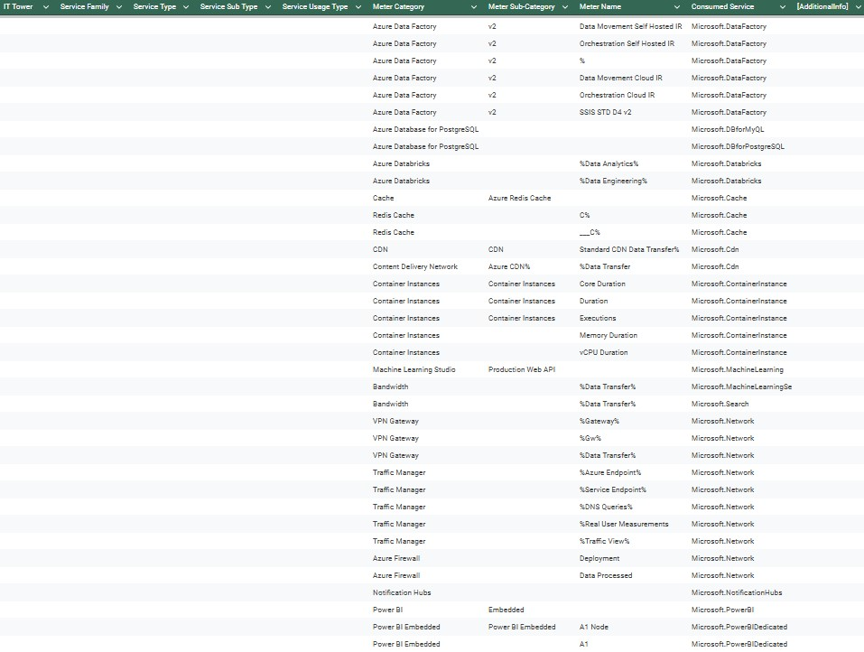

# Лабораторная работа 2

# Сравнение сервисов Amazon Web Services и Microsoft Azure. Создание единой кросс-провайдерной сервисной модели.

## Вариант 5

### Выполнили

Гайдук Алина, Соболев Артём. Команда: Любим котов

Фоточка перед началом :3

### Цель работы

Получение навыков аналитики и понимания спектра публичных облачных сервисов без привязки к вендору. Формирование у студентов комплексного видения Облака.

### Дано

1. Данные лабораторной работы 1.
2. Слепок данных биллинга от провайдера после небольшой обработки в виде SQL-параметров. Символ % в начале/конце означает, что перед/после него может стоять любой набор символов.
3. Образец итогового соответствия, что желательно получить в конце. В этом же документе

### Необходимо

1. Импортировать файл .csv в Excel или любую другую программу работы с таблицами. Для Excel делается на вкладке Данные – Из текстового / csv файла – выбрать файл, разделитель – точка с запятой.
2. Распределить потребление сервисов по иерархии, чтобы можно было провести анализ от большего к меньшему (напр. От всех вычислительных ресурсов Compute дойти до конкретного типа использования - Выделенной стойка в датацентре Dedicated host usage). При этом сохранять логическую концепцию, выработанную в Лабораторной работе 1.
3. Сохранить файл и залить в соответствующую папку на Google Drive.

### Алгоритм работы

Сопоставить входящие данные от провайдера с его же документацией. Написать в соответствие колонкам справа значения 5 колонок слева, которые бы однозначно классифицировали тип сервиса. Для столбцов IT Tower и Service Family значения можно выбрать из образца. В ходе выполнения работы не отходить от принципов классификации, выбранных в Лабораторной работе 1. Например, если сервис Машинного обучения был разбит на Вычислительные мощности и Облачные сервисы, то продолжать его разбивать и в новых данных

## Ход работы

1. Чтобы выполнить данную работу, нам понадобилось изучить структуру таблицы, по которой мы затем уже классифицировали потребление сервисов. Таблица довольно схожа с таблицой из лабораторной работы 1. Ниже представлена таблица, описывающая иерархию классификации облачных сервисов в данной модели:

| **Название столбца**   | **Описание**                                                                                                                                         | **Примеры**                                                 |
| ---------------------- | ---------------------------------------------------------------------------------------------------------------------------------------------------- | ----------------------------------------------------------- |
| **IT Tower**           | Основная категория услуг, описывающая крупные области облачных технологий и их функционал.                                                           | Compute, Storage, Database                                  |
| **Service Family**     | Группа услуг, выполняющая определённые функции и относящаяся к конкретной задаче по инфраструктуре.                                                  | Management & Governance, Application Integration, Analytics |
| **Service Type**       | Конкретный тип сервиса внутри группы сервисов. Отражает его основное предназначение                                                                  | Microsoft Virtual Machines, Microsoft Azure Database        |
| **Service Sub Type**   | Уточнение функционала конкретного типа сервисов. Показывает, какие специфические возможности или аспекты сервиса используются                        | Azure Database, Azure Backup                                |
| **Service Usage Type** | Тип использования услуги, который указывает, каким образом и для каких целей потребляется ресурс. Учитывает подтипы и назначение сервиса             | Tax, Cloud Deployment, Windows Cooperation.                 |
| **Meter Category**     | Указывает на тип ресурса или услуги, предоставляемой Azure                                                                                           | Analysis Services, Azure Databricks                         |
| **Meter Sub-Category** | Указывает какой именно ресурс или услуга используется в рамках основной категории. Она позволяет более детально отслеживать использование и расходы. | Tabular, Basic                                              |
| **Meter Name**         | Название конкретного счетчика, который измеряет использование ресурса или услуги Azure                                                               | Standard S%, Basic B%                                       |
| **Consumed Service**   | Определяет, к какому сервису относится использование, чтобы связать затраты с конкретным продуктом или платформой Azure                              | Microsoft.AnalysisServices                                  |

1. Мы сопоставили исходные данные с документацией Azure, при этом сохранив логическую структуру из лабораторной работы 1 и выделили следующие сервисыч:

| **Название сервиса**              | **Описание**                                                                                                                                                                                                                                                                                          | **Примеры использования**                                                    |
| --------------------------------- | ----------------------------------------------------------------------------------------------------------------------------------------------------------------------------------------------------------------------------------------------------------------------------------------------------- | ---------------------------------------------------------------------------- |
| **Microsoft Analysis Services**   | Сервис для развертывания и управления аналитическими моделями данных. Поддерживает сложные вычисления, многомерные и табличные модели                                                                                                                                                                 | Построение аналитических моделей для анализа данных продаж и прогноза спроса |
| **Microsoft Azure Database**      | Сервис для работы с базами данных, таких как Azure SQL Database, Azure Database for MySQL и PostgreSQL, а также NoSQL базы данных, например, Cosmos DB                                                                                                                                                | Хранение и управление данными для веб-приложений                             |
| **Microsoft Azure Monitor**       | Сервис для мониторинга и аналитики, помогает собирать и анализировать данные о производительности и состоянии приложений и ресурсов, например, наблюдения за логами, метриками и создания предупреждений, а также интеграцию с инструментами автоматизации                                            | Мониторинг производительности облачных приложений                            |
| **Microsoft Virtual Machines**    | Сервис виртуализации, который позволяет развертывать и управлять виртуальными машинами в облаке Azure                                                                                                                                                                                                 | Запуск тестовых окружений для разработки                                     |
| **Microsoft Machine Learning**    | Сервис для построения, обучения и развертывания моделей машинного обучения. Предоставляет облачную платформу с поддержкой автоматизации, инструментов для обработки данных и интеграции с другими продуктами, TensorFlow или PyTorch                                                                  | Обучение нейронных сетей                                                     |
| **Microsoft Virtual Network**     | Сервис обеспечивает возможности настройки маршрутизации, настройки доступа, интеграции с локальной сетью через VPN, поддержку сетевых функций, таких как брандмауэры и балансировщики нагрузки                                                                                                        | Создание защищенной сети для приложений                                      |
| **Microsoft Load Balancer**       | Сервис распределяет входящий трафик на несколько ресурсов, таких как виртуальные машины или инстансы приложений. Он поддерживает высокую доступность, автоматическое масштабирование и обеспечивает равномерное распределение нагрузки                                                                | Равномерное распределение трафика между серверами веб-приложения             |
| **Microsoft Event Grid**          | Сервис маршрутизации событий, который упрощает создание событийно-ориентированных архитектур. Он обеспечивает масштабируемую, низколатентную доставку событий между источниками и подписчиками                                                                                                        | Обработка событий                                                            |
| **Microsoft Storage Service**     | Сервис для хранения данных в облаке. Они включают различные решения. Возможность хранения больших данных, файловое хранилище для совместного использования файлов, дисковое хранилище для виртуальных машин. Сервис ориентированы на высокую доступность, масштабируемость и безопасность данных      | Хранение резервных копий данных                                              |
| **Microsoft Media Services**      | Сервис предоставляет инструменты для обработки мультимедийного контента. Это выбор для потоковых сервисов, видеохостинга и доставки мультимедиа высокого качества на различные устройства                                                                                                             | Организация видеотрансляций для спортивных мероприятий                       |
| **Microsoft Internet of Things**  | Включает сервисы, такие как IoT Hub, IoT Central и Azure Digital Twins, которые позволяют создавать масштабируемые IoT-решения с аналитикой, автоматизацией и интеграцией с другими облачными сервисами                                                                                               | Пправление умными устройствами в системе умного дома                         |
| **Microsoft Azure Backup**        | Сервис резервного копирования и восстановления данных, который защищает приложения или базы данных. Он автоматизирует процесс резервирования, предоставляет возможности для точного восстановления и обеспечивает надежность                                                                          | Резервное копирование баз данных                                             |
| **Microsoft Azure Site Recovery** | Это решение для обеспечения высокой доступности и аварийного восстановления, которое позволяет минимизировать время простоя. Azure Site Recovery автоматически реплицирует рабочие нагрузки из локальной среды или другой облачной инфраструктуры в Azure, поддерживая их доступность в случае сбоев. | Поддержание работоспособности приложений при сбоях                           |
| **Microsoft Azure Storage**       | Сервис для хранения данных, включающий блоб-хранилище, файловое хранилище, очереди и таблицы. Azure Storage подходит для любых задач: от хранения резервных копий и архивов до обработки больших объемов данных для аналитики или разработки приложений.                                              | ОХранение больших объемов данных для анализа                                 |
| **Microsoft Compute**             | Сервис обеспечивает вычислительные ресурсы для запуска приложений и служб. Эти решения позволяют масштабировать ресурсы в зависимости от нагрузки и потребностей, предлагая гибкость, высокую производительность и надежность                                                                         | Развертывание контейнеров с микросервисной архитектурой                      |

## Результат работы:

P. S. сам .csv файл вы можете найти в папке репозитория =)

## Вывод:

Мы ознакомились с документацией, провели тщательный анализ слепка биллинга и описали различные типов сервисов, сохраняя логическую структуру лабораторной работы 1. Мы так же выделили их семейства и подтипы согласно иерархии. Нами были освоены методы распределения потребления сервисов с использованием данных биллинга. Знакомство с облачными сервисами прошло успешно.

А вот вам фотка на прощание!!! С Новым годом!

