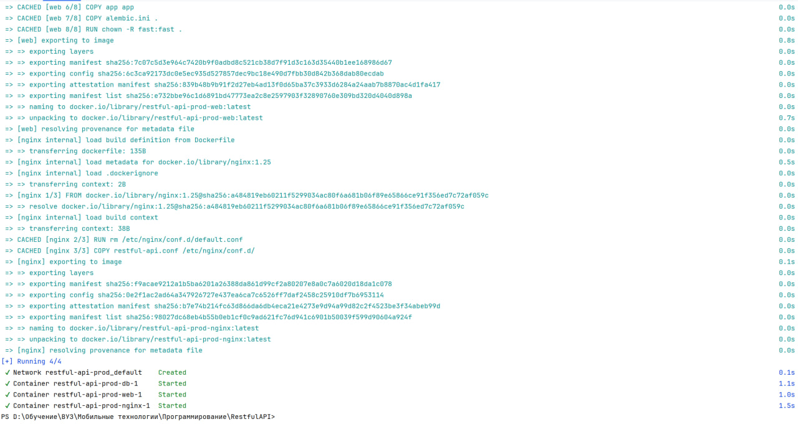

# Лабораторная работа №2*

Необходимо написать хороший и плохой Docker compose

## Выполнили

Гайдук Алина (К3241), Соболев Артем (К3240)


## Техническое задание

1. Написать “плохой” Docker compose файл, в котором есть не менее трех “bad practices” по их написанию
2. Написать “хороший” Docker compose файл, в котором эти плохие практики исправлены
3. В Readme описать каждую из плохих практик в плохом файле, почему она плохая и как в хорошем она была исправлена, как исправление повлияло на результат
4. После предыдущих пунктов в хорошем файле настроить сервисы так, чтобы контейнеры в рамках этого compose-проекта так же поднимались вместе, но не "видели" друг друга по сети. В отчете описать, как этого добились и кратко объяснить принцип такой изоляции

## Результат

Два Docker compose файла, в одном bad practices, а в другом best practices. Настроить соединение в контейнерах

## Система

Windows

## Ход работы

Для этой Лабораторной работы мы взяли docker compose файл, который реализован в проекте одного из участников команды "Любим котов". Данный проект можно найти и посмотреть [здесь](https://github.com/Artsobol/RestfulAPI). Мы запустим docker compose, а также удостоверимся в работе dockefile из лабораторной работы 2

### Docker compose с bad practices

Напишем плохой Docker compose файл с плохими практиками

```Dockerfile
name: restful-api-prod
services:
  web:
    build:
      context: .
      dockerfile: ./app/Dockerfile.prod
    volumes:
      - /tmp:/app
    command: gunicorn app.main:app --workers 4 --worker-class uvicorn.workers.UvicornWorker --bind 0.0.0.0:8000
    depends_on:
      - db
    environment:
      - DEBUG=True

  db:
    image: postgres:17
    volumes:
      - postgres_data:/var/lib/postgresql/data/
    environment:
      - POSTGRES_USER=postgres_user
      - POSTGRES_PASSWORD=postgres_password
      - POSTGRES_DB=postgres_database
    restart: always

  nginx:
    build: nginx
    ports:
      - 80:80
    depends_on:
      - web

volumes:
  postgres_data:
```

**Плохие практики**:

1. `DEBUG=True` - Включение `DEBUG` в Production может привести к утечке конфиденциальных данных

2. Хранение данных `POSTGRES_PASSWORD=postgres_password`, `POSTGRES_USER=postgres_user`, `POSTGRES_DB=postgres_database` - плохая практика. Эти данные могут быть украдены

3. `restart: always` - всегда перезапускать контейнер при сбое - плохая практика. Бесконечные перезапуски контейнера могут скрыть серьезные ошибки, которые требуют ручного вмешательства

4. Нет ограничения на использование ресурсов. Контейнер может использовать все ресурсы хост машины, что приведет к замедлению работы других контейнеров, также контейнеры могут потреблять больше ресурсов, чем им необходимо

### Docker compose с best practices

Исправим плохие практики

```Dockerfile
name: restful-api-prod
services:
  web:
    build:
      context: .
      dockerfile: ./app/Dockerfile.prod
    command: gunicorn app.main:app --workers 4 --worker-class uvicorn.workers.UvicornWorker --bind 0.0.0.0:8000
    depends_on:
      - db
    deploy:
    resources:
      limits:
        cpus: '0.5' 
        memory: 1G

  db:
    image: postgres:17
    volumes:
      - postgres_data:/var/lib/postgresql/data/
    secrets:
      - postgres_user
      - postgres_db
      - postgres_password
    environment:
        POSTGRES_USER_FILE: /run/secrets/postgres_user
        POSTGRES_DB_FILE: /run/secrets/postgres_db
        POSTGRES_PASSWORD_FILE: /run/secrets/postgres_password
    restart: on-failure
    deploy:
    resources:
      limits:
        cpus: '0.5' 
        memory: 1G

  nginx:
    build: nginx
    ports:
      - 80:80
    depends_on:
      - web

volumes:
  postgres_data:
```

**Хорошие практики**:

1. Использование `secrets` для данных. Так данные будут защищены и их не получится украсть

2. Использование ограничение ресурсов для контейнера хорошая практика, так как это обеспечивает более предсказуемое поведение программы, не перегружает систему и защищает систему от утечек памяти

3. `restart: on-failure` - контейнер будет перезапускаться теперь только, если произошел из-за сбоя программы. Это помогает быстрее обнаружить критические ошибки

4. Убрали `DEBUG=True`. Теперь в случае ошибки не будет передаваться отладочная информация, которая может содержать конфиденциальные данные

### Сборка

Выполним сборку

 



Проверим, что все контейнеры запустились


Зайдем в контейнер

 

### Настройка соединения контейнеров

Контейнеры поднимаются вместе, так как они описаны в одном docker compose файле, Docker автоматически запускает все сервисы вместе. Притом они запускаются в определенной последовательности благодаря указанным зависимостям `depends_on`. Они не видят друг друга в сети, так как мы им прописали каждую свою сеть. Изначально docker compose создаёт общую сеть для всех контейнеров, которые в нем прописаны. Благодаря этому они могут обращаться друг к другу по внутренним DNS-именам. С помощью `networks` мы указали каждому контейнеру свою сеть, благодаря чему они теперь не видят друг друга

### Не указываем networks

```Dockerfile
name: restful-api-prod
services:
  web:
    build:
      context: .
      dockerfile: ./app/Dockerfile.prod
    command: gunicorn app.main:app --workers 4 --worker-class uvicorn.workers.UvicornWorker --bind 0.0.0.0:8000
    depends_on:
      - db
    deploy:
    resources:
      limits:
        cpus: '0.5' 
        memory: 1G

  db:
    image: postgres:17
    volumes:
      - postgres_data:/var/lib/postgresql/data/
    environment:
      - POSTGRES_USER=postgres_user
      - POSTGRES_PASSWORD=postgres_password
      - POSTGRES_DB=postgres_database
    restart: on-failure
    deploy:
    resources:
      limits:
        cpus: '0.5' 
        memory: 1G

  nginx:
    build: nginx
    ports:
      - 80:80
    depends_on:
      - web

volumes:
  postgres_data:
```

 

### Указываем networks

```Dockerfile
name: restful-api-prod
services:
  web:
    build:
      context: .
      dockerfile: ./app/Dockerfile.prod
    command: gunicorn app.main:app --workers 4 --worker-class uvicorn.workers.UvicornWorker --bind 0.0.0.0:8000
    depends_on:
      - db
    deploy:
    resources:
      limits:
        cpus: '0.5' 
        memory: 1G
    networks:
      - web_net

  db:
    image: postgres:17
    volumes:
      - postgres_data:/var/lib/postgresql/data/
    environment:
      - POSTGRES_USER=postgres_user
      - POSTGRES_PASSWORD=postgres_password
      - POSTGRES_DB=postgres_database
    restart: on-failure
    deploy:
    resources:
      limits:
        cpus: '0.5' 
        memory: 1G
    networks:
      - db_net

  nginx:
    build: nginx
    ports:
      - 80:80
    depends_on:
      - web
    networks:
      - nginx_net

volumes:
  postgres_data:

networks:
  web_net:
  db_net:
  nginx_net:
```


## Вывод

Мы научились работать с docker compose, управляя несколькими контейнерами в проекте. Узнали плохие и хорошие практики при написании docker compose. Научились работать с сетью в docker compose, изолировать контейнеры внутри одного docker compose

## Источники, которые мы использовали

[Руководство по docker compose](https://habr.com/ru/companies/ruvds/articles/450312/)

[Написание docker compose](https://www.youtube.com/watch?v=p8tNcUIQzZU)

[Как работает сеть в Docker](https://www.youtube.com/watch?v=ctJnI43ermQ)


