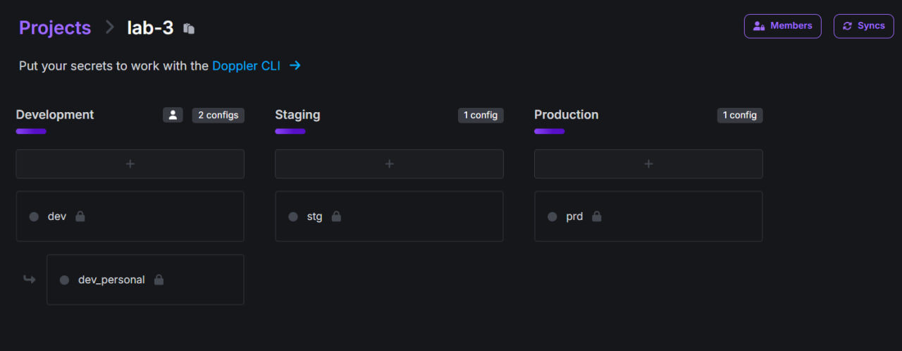
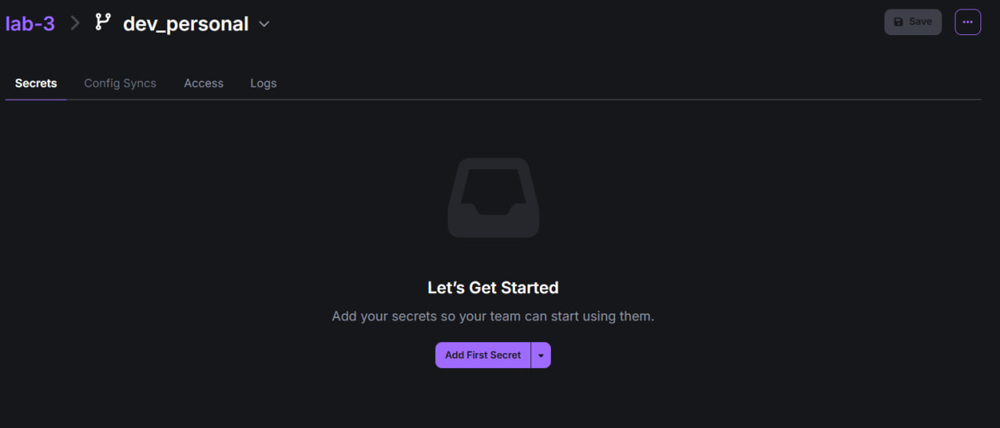
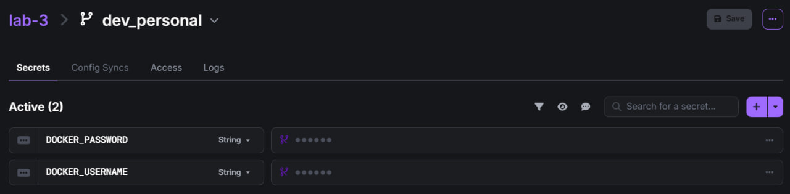
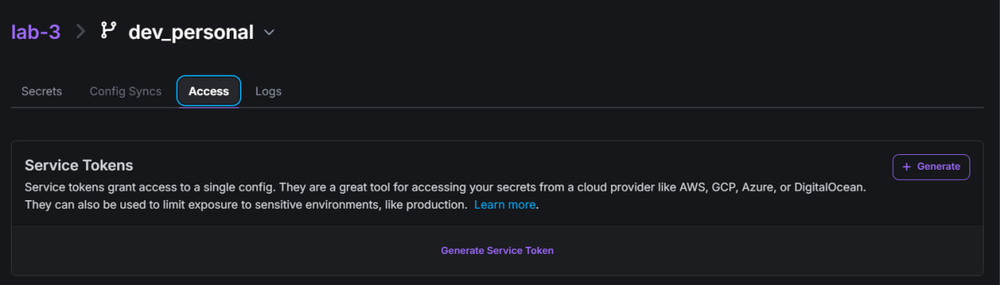
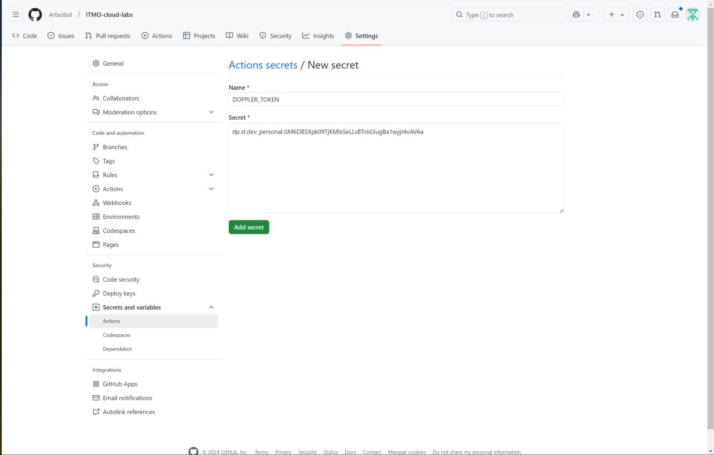
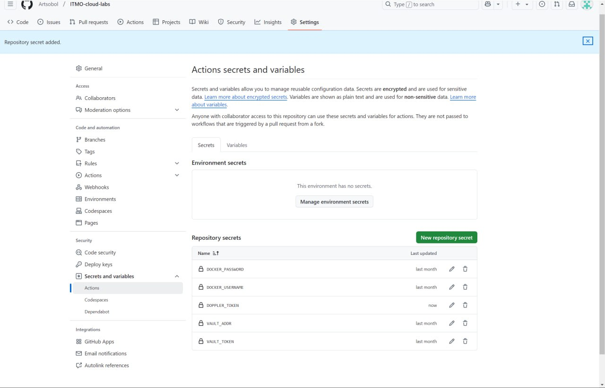
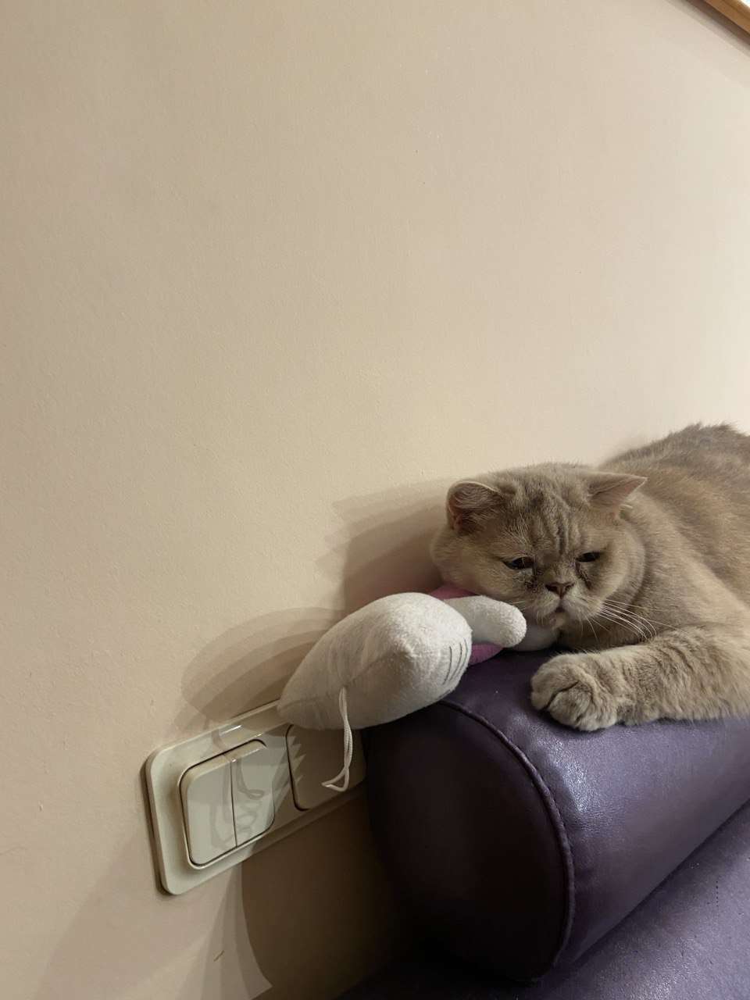

# Лабораторная 3*

Сделать красиво работу с секретами, а также описать, почему хранение секретов в CI/CD переменных репозитория не является хорошей практикой.

## Работу выполнили:

Гайдук Алина, Соболев Артем.
Команда: "Любим котов":3

По традиции фоточка: 


## Ход работы:

Когда мы пытались установить Hashicorp Vault, наши лица были как на у Мишки на фотке выше. Мы честно пытались (!!!), но у нас не получилось, и, большое спасибо нашим коллегам, мы нашли хорошую альтернативу-секретохранилку - Doppler.

Действительно, Doppler оказался очень удобным в использовании. У него интуитивно понятный интерфейс, он легко интегрируется с CI/CD пайплайнами. К тому же, у нас, как у жителей РФ, не возникает никаких проблем при регистрации на сайте допплера, в отличие от многих других секретохранилок:))

### Итак, что же нужно сделать?

Во-первых, нужно перейти на сайт допплера [тык](https://www.doppler.com/) и зарегистрироваться. Я всегда сижу с впном и поэтому не уверена, нужен ли он при регистрации, но на всякий случай лучше включить.

Во-вторых, нужно создать проект. Мы назвали проект "lab-3", что видно на скрине.



Далее переходим в "dev_personal". Сюда мы можем добавить секреты.



Мы решили взять CI/CD файл с третьей лабораторной, там мы использовали секреты ```DOCKER_USERNAME``` и ```DOCKER_PASSWORD``` для аутентификации в докер хабе. Добавим эти секреты проекту на Допплере:
 


Далее переходим во вкладку ```Access``` и генерируем токен для гитхаба, нажав, как ни странно, на кнопку ```Generate```



Обязательно нужно скопировать сам токен сразу!!! Иначе придется заново генерировать...

Переходим в наш репозиторий на GitHub. В разделе настроек (Settings) добавляем скопированный токен, назвав его "DOPPLER_TOKEN".



И вот, добавленные нами секреты теперь на Github!! Среди них есть три секрета, которые Допплер создал и экспортировал сам для корректной работы.



Теперь переходим к самому пайплайну. Мы немного подкорректировали наш ci/cd файл, результат ниже:

```
name: good ci/cd

on: [push, pull_request]

jobs:
  build:
    runs-on: ubuntu-20.04

    steps:
      - name: Checkout code
        uses: actions/checkout@v3

      - name: Set up Python 3.8
        uses: actions/setup-python@v3
        with:
          python-version: 3.8

      - name: Cache pip dependencies
        uses: actions/cache@v3
        with:
          path: ~/.cache/pip
          key: ${{ runner.os }}-pip-${{ hashFiles('**/requirements.txt') }}
          restore-keys: |
            ${{ runner.os }}-pip-

      - name: Create virtual environment
        run: python -m venv venv

      - name: Install dependencies
        run: |
          venv/bin/pip install -r lab3/good_cicd/requirements.txt

      - name: Test
        env:
          PYTHONPATH: .
        run: |
          venv/bin/pytest lab3/good_cicd/tests --cov=lab3/good_cicd/src

  deploy:
    if: github.ref == 'refs/heads/main'
    runs-on: ubuntu-20.04
    needs: build
  
    steps:
      - name: Checkout code
        uses: actions/checkout@v3

      - name: Install Doppler CLI
        run: sudo curl -sLf --retry 3 --retry-delay 2 https://cli.doppler.com/install.sh | sudo sh


      - name: Authenticate with Doppler
        env:
          DOPPLER_TOKEN: ${{ secrets.DOPPLER_TOKEN }}
        run: doppler setup --token $DOPPLER_TOKEN --no-prompt


      - name: Build Docker Image
        run: |
          docker build -t myapp -f lab3/good_cicd/Dockerfile lab3/good_cicd

      - name: Deploy
        env:
          DOPPLER_TOKEN: ${{ secrets.DOPPLER_TOKEN }}
        run: |
          echo "Fetching secrets..."
          DOCKER_USERNAME=$(doppler secrets get DOCKER_USERNAME --plain)
          DOCKER_PASSWORD=$(doppler secrets get DOCKER_PASSWORD --plain)

          echo "Deploying..."
          echo "$DOCKER_PASSWORD" | docker login -u "$DOCKER_USERNAME" --password-stdin
          docker tag myapp $DOCKER_USERNAME/myapp:latest
          docker push $DOCKER_USERNAME/myapp:latest

      - name: Clean up environment
        run: |
          rm -rf dist build *.egg-info
          docker logout
```

### Что изменилось?

1. ```
    - name: Install Doppler CLI
        run: sudo curl -sLf --retry 3 --retry-delay 2 https://cli.doppler.com/install.sh | sudo sh
    ```
Мы добавили установку Doppler CLI в деплое. Здесь важно использовать привилегии суперпользователя (sudo прописать в общем)

2.  ```
    - name: Authenticate with Doppler
        env:
          DOPPLER_TOKEN: ${{ secrets.DOPPLER_TOKEN }}
        run: doppler setup --token $DOPPLER_TOKEN --no-prompt
    ```
Аутентификация в Doppler через добавленный на GitHub Actions секрет DOPPLER_TOKEN. Здесь команда ```doppler setup``` используется для автонастройки CLI без вопросов в интерактивном режиме.

3. ```
    - name: Deploy
        env:
          DOPPLER_TOKEN: ${{ secrets.DOPPLER_TOKEN }}
        run: |
          echo "Fetching secrets..."
          DOCKER_USERNAME=$(doppler secrets get DOCKER_USERNAME --plain)
          DOCKER_PASSWORD=$(doppler secrets get DOCKER_PASSWORD --plain)
    ```
Здесь мы добавили команду ```doppler secrets get```, которая позволяет допплеру получать значения секретов.

Запускаем пайплайн и видим, что все успешно!



### Почему наш способ красивый?

1. Это безопасно, тк секреты не светятся в логах. К тому же, все секреты в допплере хранятся в зашифрованном виде.

2. На мой взгляд, Doppler является наиудобнейшим решением для хранения секретов. Он легко интегрируется с GitHub Actions + он понятен в использовании. Еще одним плюсом является то, что если мы изменим секрет в допплере, то он автоматически обновится на всех связанных сервисах.

3. Масштабируемость. Допплер легко справляется с увеличением количества секретов.

4. Допплер поддерживает разные конфигурации для окружений - ```development```, ```staging```, ```production```. Между ними легко переключаться => гибкость работы.

5. Централизованное хранение секретов в одном месте, что опять же удобно, т. к. не нужно управлять секретами в разных местах.

### Почему хранение секретов в CI/CD переменных репозитория не является хорошей практикой?

1. Это небезопасно=)). Переменные могут засветиться в логах пайплайна + если кто-то нехороший получит доступ к репозиторию, то он получит доступ ко всем секретам.

2. Переменные хранятся отдельно для каждого репозитория, что усложняет управление секретами.

3. Для каждого окружения нужно вручную создавать и обновлять секреты.

4. Кто-то может просто случайно удалить секреты, и в приложении будут сбои.

## Вывод:

Мы создали секреты в проекте на Doppler, сгенерировали токен и интегрировали его на GH. Чуть подкорректировали CI/CD файл, добавив установку и аутентификацию в Doppler, и получили действительно красивое решение для хранения секретов. Хочется поблагодарить однокурсников за идею работать с Допплером. Выполнять лабораторную работу, используя его, было только в удовольствие.


# Всем добра и позитива:3