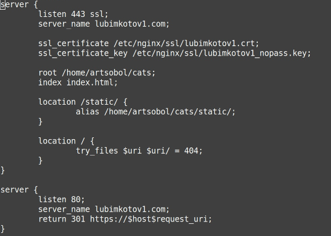

# Лабораторная работа №1

Необходимо настроить nginx по заданному ТЗ.

## Выполнили:

Гайдук Алина (К3241), Соболев Артем (К3240)

## Техническое задание

Настроить nginx так, что:

1. Должен работать по https c сертификатом
2. Настроить принудительное перенаправление HTTP-запросов (порт 80) на HTTPS (порт 443) для обеспечения безопасного соединения.
3. Использовать alias для создания псевдонимов путей к файлам или каталогам на сервере.
4. Настроить виртуальные хосты для обслуживания нескольких доменных имен на одном сервере.
5. Что угодно еще под требования проекта

## Результат

Предположим, что у вас есть два пет проекта на одном сервере, которые должны быть доступны по https. Настроенный вами веб сервер умеет работать по https, относить нужный запрос к нужному проекту, переопределять пути исходя из требований пет проектов.

## Система

Linux Ubuntu 24.04 LTS

## Ход работы

### 1. Создание пет проектов

В качестве пет проектов мы использовали два простейших сайта на html.
Вот пример одного из них:

```html
<!DOCTYPE html>
<html lang="ru">
<head>
    <meta charset="UTF-8">
    <meta name="viewport" content="width=device-width, initial-scale=1.0">
    <title>Первый сайт</title>
</head>
<body>
    <h1>Всем привет=) Это фотка Мишки, кошки одной из нашей команды</h1>
    <p>А вот и она:</p>
    
</body>
</html>
```

### 2. Установка nginx и OpenSSL

Мы установили nginx и OpenSSL c помощью терминала Linux. Чтобы проверить, что все установлено и работает корректно, заходим в любой браузер (в нашем случае Firefox) и в адресной строке набираем ```localhost```:
 

К счастью, все верно!

### 3. Создание сертификатов и ключей

Для начала, с помощью команды ```sudo mkdir /etc/nginx/ssl``` создаем папку для хранения сертификатов. Далее переходим к генерации приватного ключа и запроса на сертификат (csr) для первого проекта (lubimkotov1):
 

Здесь нам необходимо ввести информацию о сервере. 

Чтобы создать самоподписанный сертификат, используем следующие команды:
 

Успех! Мы получили сертификат, который будет действовать год.

Делаем то же самое для второго проекта.

### 4. Изменяем права доступа и создаем домены

Нам было необходимо поменять права доступа к директории с сертификатами и приватными ключами так, чтобы мы имели полный доступ (на запись, чтение и выполнение). Далее можно зайти в саму папку ssl и с помощью команды ```ls``` просмотреть ее содержимое. Как мы видим, все необходимые сертификаты и ключи на месте!


Приступим к созданию доменов. В терминале прописываем
```sudo nano etc/hosts```
Попадаем в редактор. Установим lubimkotv1.com и lubimkotov2.com (извините за страшный скрин, мы случайно):


Победа!!! Осталось только прописать файлы конфигурации

### 5. Настраиваем перенаправление с HTTP на HTTPS для проектов
Создав конфигурационные файлы для наших проектов, заходим в них через редактор c помощью команды ```sudo nano``` и добавляем блок для перенаправления HTTP-запросов на HTTPS:

```
server {
    listen 80;
    server_name lubimkotov1.com;
    return 301 https://$hostrequest_uri;
}
```

Когда пользователь будет обращаться к нашим сайтам через http, nginx будет перехватывать этот запрос и перенаправлять на HTTPS. Клиент получает ответ с кодом 301 и моментально отправляет запрос, но уже с защищенным соединением.

Добавляем то же самое в конфигурационный файл второго проекта (lubimkotov2)

### 6. Описываем сервер
В файле конфигурации для каждого проекта так же необходимо прописать блок, описывающий конфигурацию сервера для работы по HTTPS на 443 порту.
Итоговый файл для первого проекта будет выглядеть следующим образом:


Для второго проекта:


Сервер будет слушать запросы на 443 порту и использовать SSL дли шифрования соединения. Мы так же прописали alias для создания псевдонимов путей к файлам на сервере.

### 7. Активируем файлы конфигурации

Мы вернулись в терминал и использовали следующую команду:
``` sudo ln -s /etc/nginx/sites-available/lubimkotov1 /etc/nginx/sites-enabled/ ```

Благодаря этой команде мы активировали файл конфигурации сайта lubimkotov1, создав символическую ссылку на него из директории ```/etc/nginx/sites-available``` в директорию ```/etc/nginx/sites-enabled/``` (здесь хранятся ссылки на активные сайты, которые будет обслуживать nginx).

Для второго сайта прописываем аналогично:
```sudo ln -s /etc/nginx/sites-available/lubimkotov2 /etc/nginx/sites-enabled/ ```

### 8. Перезапускаем nginx

Для начала проверим, есть ли ошибки в конфигурации Nginx с помощью команды ```sudo nginx -t``` 

Далее перезапускаем nginx:
```sudo systemctl restart nginx```

### 9. Запускаем сайты

В адресной строке браузера вводим lubimkotov1.com и переходим на страницу. Видим Мишель, а значит с сайтом все в порядке!


Посмотрим на сертификат с данными о сервере:


Повторяем для второго сайта:


И снова радуемся сертификату:


Сайты корректно запускаются, alias работает, соединение безопасное, а значит можно отдыхать!!!

## Вывод

Мы поняли как работать с nginx, настроили сервер так, чтобы он работал по https с сертификатом, научились перенаправлять http на https, использовали alias и настроили виртуальные хосты. Было трудно, но кажется, что мы справились

## Источники

[Что такое Nginx](https://www.youtube.com/watch?v=6Df5vJC-G8Q)

[Руководство по Nginx](https://nginx.org/ru/docs/beginners_guide.html)

[alias nginx](https://www.youtube.com/watch?v=8P2r0xSXk28)
