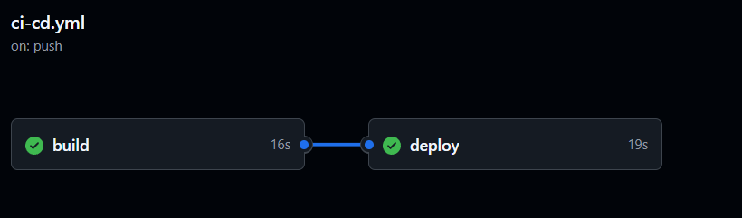

# Лабораторная работа №3.

Необходимо написать CI/CD файл.

## Выполнили

Гайдук Алина (К3241), Соболев Артем (К3240)


## Техническое задание

1. Написать “плохой” CI/CD файл, который работает, но в нем есть не менее пяти “bad practices” по написанию CI/CD
2. Написать “хороший” CI/CD, в котором эти плохие практики исправлены
3. В Readme описать каждую из плохих практик в плохом файле, почему она плохая и как в хорошем она была исправлена, как исправление повлияло на результат

## Результат

Два CI/CD файла, в одном bad practices, а в другом best practices

## Система

Windows

## Ход работы

### "Плохой" CI/CD.

```yml

name: Python CI/CD Pipeline - Bad Practices

on: [push, pull_request]

jobs:
  build:
    runs-on: ubuntu-latest

    steps:
      - name: Checkout code
        uses: actions/checkout@v2

      - name: Set up Python 3.8
        uses: actions/setup-python@v2
        with:
          python-version: 3.8


      - name: Install dependencies
        run: |
          pip install numpy pandas requests pytest

      - name: Test
        run: |
             venv/bin/pytest lab3/good_cicd/tests --cov=lab3/good_cicd/src || echo "Ignoring test errors"

      - name: Build Docker Image
        run: |
          docker build -t myapp -f lab3/good_cicd/Dockerfile lab3/good_cicd
            
      - name: Deploy
        env:
          DOCKER_USERNAME: artsobol06
          DOCKER_PASSWORD: Pn@q9ET#Ejkn@a4
        run: |
            echo "Deploying..."
            docker login -u $DOCKER_USERNAME -p $DOCKER_PASSWORD
            docker tag myapp artsobol06/myapp:latest
            docker push artsobol06/myapp:latest
```
Опишем плохие практики, допущенные в этом файле:

1. ```runs-on: ubuntu-latest```
Отсутствие использования конкретной версии ubuntu. Это является плохой практикой, так как может привести к несовместимостям, если код зависит от определенной версии ОС или ее библиотек.
2. ```pip install numpy pandas requests```
Установка зависимостей без использования `requirments.txt`. Могут возникнуть проблемы из-за использования разных версий зависимостей.\
3. Игнорирование ошибок тестов. Использование || echo "Ignoring test errors" заставляет пайплайн продолжать выполнение даже при сбое тестов.
4. 
  ```DOCKER_USERNAME: artsobol06 DOCKER_PASSWORD: Pn@q9ET#Ejkn@a4```
Хранить логин и пароль прямо в файле плохая практика, лучше для этого использовать secrets
5. Нет очистки окружения после выполнения. Это может засорить память

#### Запустили пайплайн с плохим CI/CD. Все получилось!
 
 
 P.S. указанный аккаунт на докерхабе мы создали специально для этой лабы, поэтому ничем не рискуем
 
 Посмотреть запущенные пайплайны можно по [ссылке](https://github.com/Artsobol/ITMO-cloud-labs/actions).

 Cами CI/CD файлы можно посмотреть [тут](https://github.com/Artsobol/ITMO-cloud-labs/tree/main/.github/workflows).


### Хороший CI/CD

```yml
name: good ci/cd

on: [push, pull_request]

jobs:
  build:
    runs-on: ubuntu-20.04

    steps:
      - name: Checkout code
        uses: actions/checkout@v3

      - name: Set up Python 3.8
        uses: actions/setup-python@v3
        with:
          python-version: 3.8

      - name: Cache pip dependencies
        uses: actions/cache@v3
        with:
          path: ~/.cache/pip
          key: ${{ runner.os }}-pip-${{ hashFiles('**/requirements.txt') }}
          restore-keys: |
            ${{ runner.os }}-pip-

      - name: Create virtual environment
        run: python -m venv venv

      - name: Install dependencies
        run: |
          venv/bin/pip install -r lab3/good_cicd/requirements.txt

      - name: Test
        env:
          PYTHONPATH: .
        run: |
          venv/bin/pytest lab3/good_cicd/tests --cov=lab3/good_cicd/src

  deploy:
    if: github.ref == 'refs/heads/main'
    runs-on: ubuntu-20.04
    needs: build
  
    steps:
      - name: Checkout code
        uses: actions/checkout@v3

      - name: Build Docker Image
        run: |
          docker build -t myapp -f lab3/good_cicd/Dockerfile lab3/good_cicd

      - name: Deploy
        env:
          DOCKER_USERNAME: ${{ secrets.DOCKER_USERNAME }}
          DOCKER_PASSWORD: ${{ secrets.DOCKER_PASSWORD }}
        run: |
          echo "Deploying..."
          echo "$DOCKER_PASSWORD" | docker login -u "$DOCKER_USERNAME" --password-stdin
          docker tag myapp $DOCKER_USERNAME/myapp:latest
          docker push $DOCKER_USERNAME/myapp:latest

      - name: Clean up environment
        run: |
          rm -rf dist build *.egg-info
          docker logout

```

#### Что мы исправили?

1. `runs-on: ubuntu-20.04`
    Добавили конкретную версию Ubuntu (20.04 вместо ubuntu-latest). Это поможет избежать несовместимости при обновлении ubuntu.
2. `venv/bin/pip install --no-cache-dir -r lab3/good_cicd/requirements.txt`
    Устанавливаем зависимости из файла requirements.txt
3. Ошибки тестов не игнорируются. Если какой-либо тест завершится сбоем, команда pytest завершится с ненулевым кодом возврата, что приведет к остановке выполнения пайплайна на этом шаге.
4. ```
    DOCKER_USERNAME: ${{ secrets.DOCKER_USERNAME }}
    DOCKER_PASSWORD: ${{ secrets.DOCKER_PASSWORD }}
    ```
    Используем GitHub secrets для безопасной аутентификации в Docker.
5. ```rm -rf dist build *.egg-info```
    Добавили очистку окружения для удаления временных файлов по завершению работы.
6. Добавили кеширование установки зависимостей в  CI/CD процесс, использовав встроенный в GitHub Actions cache для кеширования папки с установленными зависимостями.
    ```
    - name: Cache pip dependencies
        uses: actions/cache@v3
        with:
          path: ~/.cache/pip
          key: ${{ runner.os }}-pip-${{ hashFiles('**/requirements.txt') }}
          restore-keys: |
          ${{ runner.os }}-pip-
      ```
7. Перенесли деплой на ветку main
  ```
  deploy:
    if: github.ref == 'refs/heads/main'
    runs-on: ubuntu-20.04
    needs: build
  ```
  

#### Запустили пайплайн с хорошим ci/cd. Успех!!
 
 
 Посмотреть запущенные пайплайны можно по [ссылке](https://github.com/Artsobol/ITMO-cloud-labs/actions).

 Cами CI/CD файлы можно посмотреть [тут](https://github.com/Artsobol/ITMO-cloud-labs/tree/main/.github/workflows).


## Вывод:
 Мы ознакомились с принципами написания хорошего CI/CD файла, а так же наиболее часто встречающимися ошибками.


 Посмотреть запущенные пайплайны можно по [ссылке](https://github.com/Artsobol/ITMO-cloud-labs/actions).

 Cами CI/CD файлы можно посмотреть [тут](https://github.com/Artsobol/ITMO-cloud-labs/tree/main/.github/workflows).


 ## Всем добра и позитива:3
             
